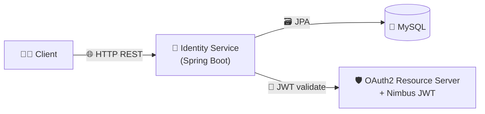
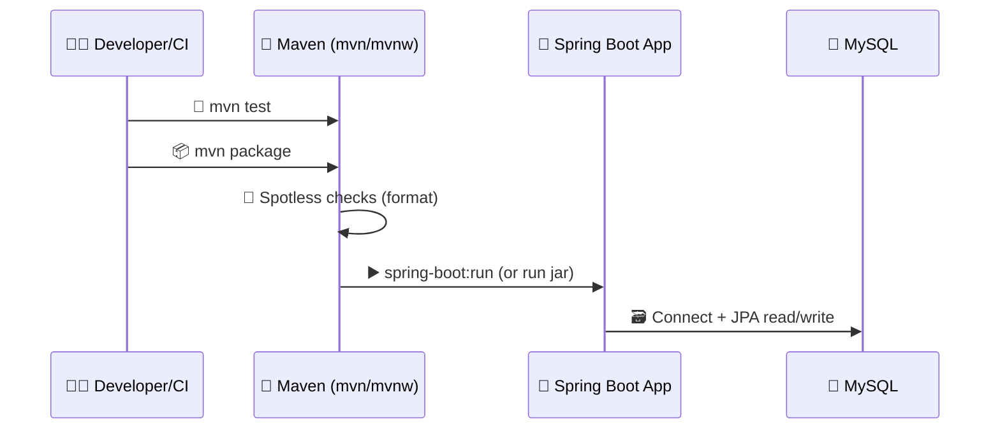

# Identity Service

> Spring Boot–based **Identity Service** (Java 17) intended to provide core identity/auth capabilities for a larger system.

---

## ✨ Overview

This repository contains a Spring Boot service that typically handles identity-related concerns such as:

- 🔐 Token/JWT validation (OAuth2 Resource Server)
- 🧾 User/identity data persistence (JPA)
- 🧪 Test-ready setup (H2 for tests)

> The exact endpoints and domain model depend on the implementation under `src/main/java`.

---

## 🧰 Tech Stack

| Category | Tools |
|---|---|
| ☕ Language | Java **17** |
| 🌱 Framework | Spring Boot **3.2.2** |
| 🌐 Web | Spring Web (REST) |
| 🗃️ Persistence | Spring Data JPA |
| ✅ Validation | spring-boot-starter-validation |
| 🔑 Security / Crypto | Spring Security Crypto |
| 🪪 JWT / OAuth2 | OAuth2 Resource Server + Nimbus JOSE JWT |
| 🧩 Mapping | MapStruct |
| 🧱 Boilerplate | Lombok |
| 🧹 Formatting | Spotless (Google Java Format) |
| 🐬 DB (runtime) | MySQL |
| 🧪 DB (test) | H2 |

---

## 🗂️ Project Structure

```text
.
├── pom.xml
├── mvnw / mvnw.cmd
├── .mvn/
└── src/
    ├── main/
    │   ├── java/
    │   └── resources/
    └── test/
```

---

## 🗺️ Visualizations

### 1) 🧩 Component View



### 2) 🚀 Build & Run Flow



---

## ▶️ Build and Run

### ✅ Prerequisites

- ☕ Java **17**
- 🧰 Maven (or use the Maven Wrapper `./mvnw`)

### 🧪 Run tests

```bash
./mvnw test
```

### 🏃 Run the application

```bash
./mvnw spring-boot:run
```

### 📦 Build a jar

```bash
./mvnw clean package
```

> 📝 Runtime database dependency is **MySQL**; tests can use **H2**.

---

## 🧹 Formatting

This project uses **Spotless** with **Google Java Format**.

If builds fail on formatting:

- Ensure your IDE uses Google Java Format, or
- Run Spotless (commonly):

```bash
./mvnw spotless:apply
```

---

## 🛡️ Security Notes (High Level)

- 🪪 JWT support is included via **OAuth2 Resource Server**.
- 🔐 Password hashing/crypto utilities are included via **Spring Security Crypto**.

---

## 🧭 Next Improvements (Recommended)

- ⚙️ Document config (DB URL, username/password, JWT issuer/audience/JWK)
- 📚 Add API docs (OpenAPI/Swagger) + endpoint list
- 🐳 Add `docker-compose.yml` for local MySQL + service startup
- 🗺️ Add diagrams for packages/controllers/services/entities once confirmed
